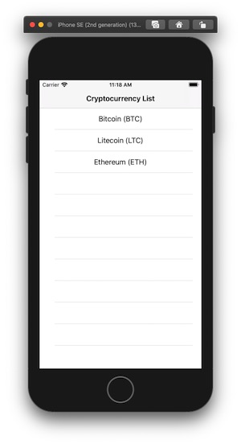

# CryptocurrencyApp

A sample Swift project to display cryptocurrency market prices, demonstrating knowledge of: good app architecture, unit testing, dependency injection. 

Data is fetched from a static JSON file hosted on Amazon S3. 

## Tech stack

- Swift 5
- PromiseKit
- Firebase analytics
- Resolver (Dependency injection)
- SwiftyMocky (unit testing)

PromiseKit is a well-known library that simplifies writing asynchronous code.

Resolver solves a problem where dependencies of view controllers/presenters/view models further in the flow have to be passed down the flows even to the objects that don't need them, so they can be passed further along. It also introduces some syntactic sugar to be able to automatically resolve dependencies marked with @Injected keyword. 

SwiftyMocky is a great framework for automatically generating mocks from protocol definitions and providing a Given statement for stubbing return values and Verify for asserting that the methods have been executed on a mock with expected parameters. It saves a lot of time by eliminating a need to write mocks manually. And that in turn lets you introduce and test well more complex business logic, which gives you confidence that more complex functionality is not going to break even after new members are introduced to the team and start moving and changing things around (without knowing all the project requirements and intricacies).  

## Architecture 

App is written using MVVM architecture. View models are extensively tested and contain business logic, while view controllers are not - they only provide a UI layer. ViewModels have no dependency on UIKit. 

Main classes: 
- `CryptoListViewController` - `CryptoListViewModel`
- `CryptoDetailViewController` - `CryptoDetailsViewModel`

ViewModels obtain data from data providers: 
- `CryptoDataProvider` (Dependency on `HttpClient`)
- `AnalyticsProvider`

Models: 
- `Cryptocurrency`

Http Stack: 
- `DefaultHttpClient` (Dependency on `URLRequestSender` which uses `URLSession`)

UI Utilities:
- `TableViewAdapter` (encapsulates UIKit TableView handling)

There are no functional bindings between ViewModels and ViewControllers. Because of that technically it's not a 'classic' MVVM architecture as introduced and cultivated by Microsoft.  

This sample project simply does not provide a solution for reflecting model changes in a ViewModel and consecutively ViewController. This could be achieved by using reactive bindings (RxSwift/Combine). 

It also demonstrates handling flow in a very limited way - there's a Router class instance that controls the flow (consisting of the cryptocurrency list view and cryptocurrency detail view), but it's very very simple. Loading ViewControllers from storyboard and binding ViewModels happen on this level. It'd be better to do that on the dependency resolution level, but that's not been implemented yet. That'd significantly simplify view controller management in the Router, making it easier to create and manage flows. 

## Screenshots

 
