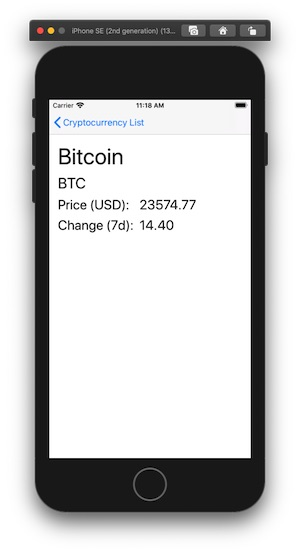

# CryptocurrencyApp

A sample Swift project to display cryptocurrency market prices, demonstrating knowledge of: good app architecture, unit testing, dependency injection. 

Data is fetched from a static JSON file hosted on Amazon S3. 

## Tech stack

- Swift 5
- PromiseKit
- Firebase analytics
- Resolver (Dependency injection)
- SwiftyMocky (unit testing)

## Screenshots

 
